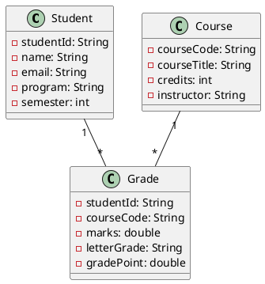
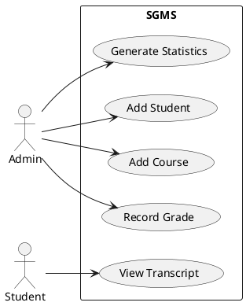

# Design Diagrams

This document contains all UML and architecture diagrams for the **Student Grade Management System**.

---

## 1. System Architecture Diagram

```
                              ┌────────────────────────────┐
                              │         Main.java          │
                              │   (Menu UI / Entry Point)  │
                              └──────────────┬─────────────┘
                                             │ uses
                                             ▼
        ┌─────────────────────────────────────────────────────────────┐
        │                          manager                            │
        │                                                             │
        │  ┌──────────────────┐ ┌──────────────────┐ ┌────────────┐  │
        │  │ StudentManager   │ │ CourseManager    │ │GradeManager│  │
        │  └────────┬─────────┘ └────────┬─────────┘ └─────┬──────┘  │
        └───────────┼─────────────────────┼─────────────────┼─────────┘
                    │                     │                 │
                    ▼                     ▼                 ▼
        ┌─────────────────────────────────────────────────────────────┐
        │                           model                             │
        │                                                             │
        │    ┌──────────┐       ┌──────────┐       ┌──────────┐      │
        │    │ Student  │       │  Course  │       │  Grade   │      │
        │    └──────────┘       └──────────┘       └──────────┘      │
        └─────────────────────────────────────────────────────────────┘
                    │                     │                 │
                    ▼                     ▼                 ▼
        ┌─────────────────────────────────────────────────────────────┐
        │                           util                               │
        │                                                             │
        │    ┌────────────────────┐       ┌─────────────────────┐     │
        │    │   FileHandler      │       │  ReportGenerator    │     │
        │    └────────────────────┘       └─────────────────────┘     │
        └─────────────────────────────────────────────────────────────┘
                                │
                                ▼
                  ┌─────────────────────────┐
                  │  data/*.csv (persistence)│
                  └─────────────────────────┘
```

---

## 2. Use Case Diagram

```
                           ┌────────────────────────────────────────────┐
                           │   Student Grade Management System          │
                           │                                            │
   ┌────────────┐          │  ┌──────────────┐     ┌──────────────┐     │
   │            │          │  │  Add Student │     │ Add Course   │     │
   │            │──────────┼─►│              │     │              │     │
   │            │          │  └──────────────┘     └──────────────┘     │
   │            │          │                                            │
   │            │          │  ┌──────────────┐     ┌──────────────┐     │
   │            │──────────┼─►│View Students │     │View Courses  │     │
   │            │          │  └──────────────┘     └──────────────┘     │
   │            │          │                                            │
   │            │          │  ┌──────────────┐     ┌──────────────┐     │
   │ Administrator├─────────┼─►│Record Grade  │     │  View CGPA   │     │
   │            │          │  └──────────────┘     └──────────────┘     │
   │            │          │                                            │
   │            │          │  ┌──────────────┐     ┌──────────────┐     │
   │            │──────────┼─►│Update Record │     │Delete Record │     │
   │            │          │  └──────────────┘     └──────────────┘     │
   │            │          │                                            │
   │            │          │  ┌──────────────────────────────────┐     │
   │            │──────────┼─►│  Generate Reports & Statistics  │     │
   └────────────┘          │  └──────────────────────────────────┘     │
                           │                                            │
   ┌────────────┐          │  ┌──────────────────────────────────┐     │
   │            │          │  │   View Transcript                │     │
   │  Student   │──────────┼─►└──────────────────────────────────┘     │
   │            │          │                                            │
   └────────────┘          └────────────────────────────────────────────┘
```

---

## 3. Class Diagram

```
  ┌─────────────────────────┐        ┌─────────────────────────┐
  │       Student           │        │        Course           │
  ├─────────────────────────┤        ├─────────────────────────┤
  │ - studentId: String     │        │ - courseCode: String    │
  │ - name: String          │        │ - courseTitle: String   │
  │ - email: String         │        │ - credits: int          │
  │ - program: String       │        │ - instructor: String    │
  │ - semester: int         │        ├─────────────────────────┤
  ├─────────────────────────┤        │ + getters / setters     │
  │ + getters / setters     │        │ + toString()            │
  │ + toString()            │        └────────────┬────────────┘
  └────────────┬────────────┘                     │
               │                                  │
               │                                  │ referenced by
               │                                  │
               │       ┌──────────────────────────▼──────────────┐
               │       │              Grade                      │
               │       ├─────────────────────────────────────────┤
               └──────►│ - studentId: String                     │
                       │ - courseCode: String                    │
                       │ - marks: double                         │
                       │ - letterGrade: String                   │
                       │ - gradePoint: double                    │
                       ├─────────────────────────────────────────┤
                       │ + setMarks(double)                      │
                       │ + calculateGrade()                      │
                       │ + getters                                │
                       └─────────────────────────────────────────┘

  ┌─────────────────────────┐        ┌─────────────────────────┐
  │    StudentManager       │        │     CourseManager       │
  ├─────────────────────────┤        ├─────────────────────────┤
  │ - students: List        │        │ - courses: List         │
  ├─────────────────────────┤        ├─────────────────────────┤
  │ + addStudent()          │        │ + addCourse()           │
  │ + removeStudent()       │        │ + removeCourse()        │
  │ + updateStudent()       │        │ + findByCode()          │
  │ + findById()            │        │ + getAllCourses()       │
  │ + getAllStudents()      │        └─────────────────────────┘
  └─────────────────────────┘

  ┌─────────────────────────┐        ┌─────────────────────────┐
  │     GradeManager        │        │    ReportGenerator      │
  ├─────────────────────────┤        ├─────────────────────────┤
  │ - grades: List          │        ├─────────────────────────┤
  ├─────────────────────────┤        │ + generateTranscript()  │
  │ + recordGrade()         │        │ + generateCourseStats() │
  │ + getGradesForStudent() │        │ + generateSystemSummary│
  │ + calculateCGPA()       │        └─────────────────────────┘
  └─────────────────────────┘
```

---

## 4. Sequence Diagram — Record Grade

```
   User         Main           GradeManager      StudentManager   CourseManager      FileHandler
    │             │                  │                  │                │                  │
    │  select "Record Grade"        │                  │                │                  │
    ├────────────►│                  │                  │                │                  │
    │             │  recordGrade()   │                  │                │                  │
    │             ├─────────────────►│                  │                │                  │
    │             │                  │  findById(sid)   │                │                  │
    │             │                  ├─────────────────►│                │                  │
    │             │                  │  ◄── Student ────│                │                  │
    │             │                  │  findByCode(cid) │                │                  │
    │             │                  ├─────────────────────────────────►│                  │
    │             │                  │  ◄────── Course ─────────────────│                  │
    │             │                  │  create Grade & add             │                  │
    │             │                  │  writeLines(grades.csv)         │                  │
    │             │                  ├──────────────────────────────────────────────────────►│
    │             │                  │  ◄─────────── ok ───────────────────────────────────│
    │             │  ◄── success ────│                  │                │                  │
    │  ◄── print "Recorded..."      │                  │                │                  │
    │             │                  │                  │                │                  │
```

---

## 5. Workflow Diagram

```
                ┌────────────┐
                │   Start    │
                └─────┬──────┘
                      ▼
             ┌────────────────────┐
             │  Display Main Menu │
             └────────┬───────────┘
                      ▼
               ┌──────────────┐
               │  Get Choice  │
               └──────┬───────┘
                      ▼
        ┌─────────────┴─────────────┐
        │     Module Selected?      │
        └─┬──────┬──────┬──────┬─────┘
          ▼      ▼      ▼      ▼
     Students Courses Grades Reports
          │      │      │      │
          └──────┴──────┴──────┘
                      ▼
              ┌──────────────────┐
              │ Submenu Operation│
              └────────┬─────────┘
                       ▼
              ┌──────────────────┐
              │  Perform Action  │
              └────────┬─────────┘
                       ▼
              ┌──────────────────┐
              │  Save to File    │
              └────────┬─────────┘
                       ▼
              ┌──────────────────┐
              │ Print Result     │
              └────────┬─────────┘
                       ▼
              ┌──────────────────┐
              │ Return to Menu   │ ◄─────┐
              └────────┬─────────┘       │
                       ▼                 │
                  ┌──────────┐           │
                  │  Exit?   │──No───────┘
                  └────┬─────┘
                       │Yes
                       ▼
                  ┌──────────┐
                  │   End    │
                  └──────────┘
```

---

## 6. ER Diagram (Storage Design)

```
   ┌──────────────┐         records          ┌──────────────┐
   │   STUDENT    │ ──────────────────────► │    GRADE     │
   ├──────────────┤  N                  1   ├──────────────┤
   │ PK studentId│                          │ PK (sid,cid) │
   │    name     │                          │    marks     │
   │    email    │                          │    letter    │
   │    program  │                          │    gp        │
   │    semester │                          └──────┬───────┘
   └──────────────┘                                 │ N
                                                    │
                                                    │ 1
                                            ┌───────▼──────┐
                                            │    COURSE    │
                                            ├──────────────┤
                                            │ PK courseCode│
                                            │    title     │
                                            │    credits   │
                                            │    instructor│
                                            └──────────────┘
```

**Schema (CSV files in `data/`):**

`students.csv`
```
studentId (PK), name, email, program, semester
```

`courses.csv`
```
courseCode (PK), courseTitle, credits, instructor
```

`grades.csv`
```
studentId (FK) + courseCode (FK) [composite PK], marks, letterGrade, gradePoint
```

---

## PlantUML Source (Optional)

If you have PlantUML installed, you can copy these blocks and render proper diagrams.

### Class Diagram (PlantUML)


### Use Case (PlantUML)

